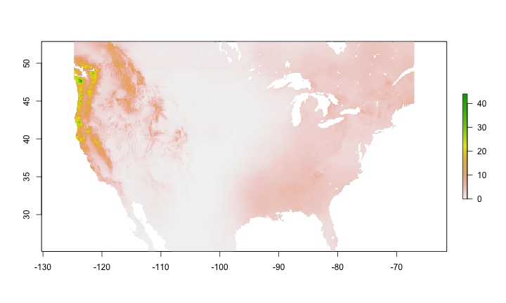

cmipr
====


[](https://travis-ci.org/ropenscilabs/cmipr)

R client for CMIP (Coupled Model Intercomparison Project) data

> Under the [World Climate Research Programme (WCRP)](https://www.wcrp-climate.org/) the Working Group on Coupled Modelling (WGCM) established the Coupled Model Intercomparison Project (CMIP) as a standard experimental protocol for studying the output of coupled atmosphere-ocean general circulation models (AOGCMs). Virtually the entire international climate modeling community has participated in this project since its inception in 1995.

Links:

* [CMIP](http://cmipr-pcmdi.llnl.gov/)
* [CMIP Data available via FTP](http://gdo-dcp.ucllnl.org/downscaled_cmip_projections/dcpInterface.html#Projections:%20Complete%20Archives)

## Install

Development version


```r
devtools::install_github("ropenscilabs/cmipr")
```


```r
library("cmipr")
```

## List files


```r
head(cmip_list_files('bcsd/yearly'))
#> # A tibble: 6 × 2
#>         date            file
#>       <date>           <chr>
#> 1 2007-09-16   bccr_bcm2_0.1
#> 2 2007-09-16 cccma_cgcm3_1.1
#> 3 2007-09-17 cccma_cgcm3_1.2
#> 4 2007-09-17 cccma_cgcm3_1.3
#> 5 2007-09-17 cccma_cgcm3_1.4
#> 6 2007-09-17 cccma_cgcm3_1.5
head(cmip_list_files('bcsd/yearly/cccma_cgcm3_1.1'))
#> # A tibble: 6 × 2
#>         date                                         file
#>       <date>                                        <chr>
#> 1 2007-09-16 cccma_cgcm3_1.1.sresa1b.monthly.Prcp.1950.nc
#> 2 2007-09-16 cccma_cgcm3_1.1.sresa1b.monthly.Prcp.1951.nc
#> 3 2007-09-16 cccma_cgcm3_1.1.sresa1b.monthly.Prcp.1952.nc
#> 4 2007-09-16 cccma_cgcm3_1.1.sresa1b.monthly.Prcp.1953.nc
#> 5 2007-09-16 cccma_cgcm3_1.1.sresa1b.monthly.Prcp.1954.nc
#> 6 2007-09-16 cccma_cgcm3_1.1.sresa1b.monthly.Prcp.1955.nc
```

## Download data


```r
key <- "bcsd/yearly/cnrm_cm3.1/cnrm_cm3.1.sresa1b.monthly.Prcp.2034.nc"
(res <- cmip_fetch(key))
#> <CMIP file>
#>    File: /Users/sacmac/Library/Caches/cmipr/cnrm_cm3.1.sresa1b.monthly.Prcp.2034.nc
#>    File size: 4.93842 MB
```

## Read data into R

Can load in a single file (gives `RasterLayer`), or many (gives `RasterBrick`)


```r
out <- cmip_read(res)
```

## Plot


```r
plot(out)
```




## Meta

* Please [report any issues or bugs](https://github.com/ropenscilabs/cmipr/issues).
* License: MIT
* Get citation information for `cmipr` in R doing `citation(package = 'cmipr')`
* Please note that this project is released with a [Contributor Code of Conduct](CONDUCT.md). By participating in this project you agree to abide by its terms.

[](https://ropensci.org)
